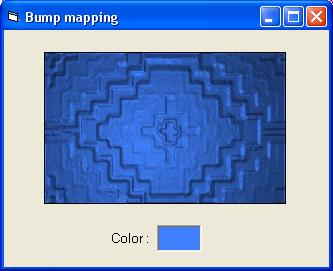

<div align="center">

## Fast bump mapping


</div>

### Description

This is very fast 2D bump mappping. You can change color of bump mapping. This is perfect example for beginners and profesionals.
 
### More Info
 


<span>             |<span>
---                |---
**Submitted On**   |2006-11-07 19:57:32
**By**             |[Safo](https://github.com/Planet-Source-Code/PSCIndex/blob/master/ByAuthor/safo.md)
**Level**          |Intermediate
**User Rating**    |5.0 (30 globes from 6 users)
**Compatibility**  |VB 6\.0
**Category**       |[Graphics](https://github.com/Planet-Source-Code/PSCIndex/blob/master/ByCategory/graphics__1-46.md)
**World**          |[Visual Basic](https://github.com/Planet-Source-Code/PSCIndex/blob/master/ByWorld/visual-basic.md)
**Archive File**   |[Fast\_bump\_2070076102007\.zip](https://github.com/Planet-Source-Code/safo-fast-bump-mapping__1-67028/archive/master.zip)

### API Declarations

```
Public Declare Function SetPixel Lib "gdi32" (ByVal hdc As Long, ByVal X As Long, ByVal Y As Long, ByVal crColor As Long) As Long
Public Declare Function GetPixel Lib "gdi32" (ByVal hdc As Long, ByVal X As Long, ByVal Y As Long) As Long
Declare Function GetObject Lib "gdi32" Alias "GetObjectA" (ByVal hObject As Long, ByVal nCount As Long, ByRef lpObject As Any) As Long
Declare Function GetBitmapBits Lib "gdi32" (ByVal hBitmap As Long, ByVal dwCount As Long, ByRef lpBits As Any) As Long
Declare Function SetBitmapBits Lib "gdi32" (ByVal hBitmap As Long, ByVal dwCount As Long, ByRef lpBits As Any) As Long
```


